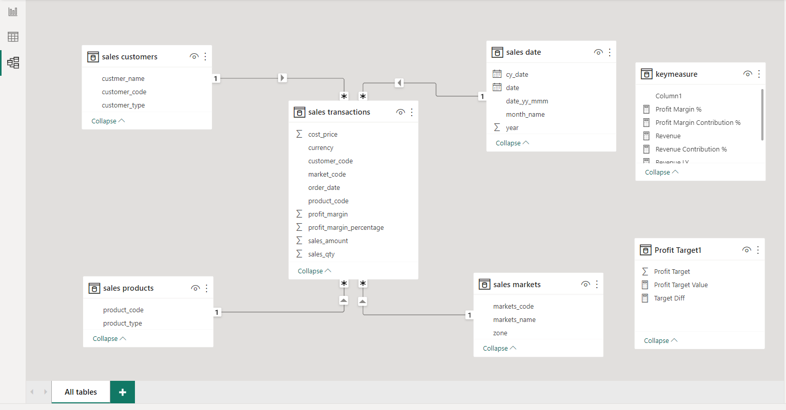

# 📊 Sales Trend & Revenue Analysis | Power BI + SQL

### **📌 Project Overview**
This project focuses on analyzing sales trends and revenue drivers for a **computer hardware company operating across India**. The goal was to transform raw transactional data into actionable insights that help leadership understand **regional performance, product profitability, and revenue growth patterns**. Using **SQL** for data extraction and transformation, and **Power BI** for modeling and visualization, an automated dashboard was built to enable **data-driven pricing and regional strategies**, projecting a **7% potential revenue uplift**.

---

## 🧾 Table of Contents
- [Problem Statement](#-problem-statement)
- [Data Overview](#-data-overview)
- [SQL Data Preparation](#-sql-data-preparation)
- [Data Cleaning & ETL (Power BI)](#-data-cleaning--etl-power-bi)
- [Data Modeling](#-data-modeling)
- [KPI Measures (DAX)](#-kpi-measures-dax)
- [Dashboard Overview](#-dashboard-overview)
- [Key Insights](#-key-insights)
- [Tools & Technologies](#-tools--technologies)
- [Author](#-author)

---

## 🧩 Problem Statement
The Sales Director of a national **computer hardware supplier** was struggling to track sales performance across regions and product lines.  
Reports from regional managers were inconsistent, and raw Excel data offered little clarity on trends.  

To address this, a **centralized, interactive Power BI dashboard** was developed, providing:  
- Real-time visibility into **sales trends** and **profitability**  
- **Regional and product-level insights**  
- Automated data updates directly from SQL database  

---

## 🗂️ Data Overview
Data was provided in the form of multiple SQL tables:  
- **Customers:** customer_id, type, region  
- **Markets:** market_code, market_name, zone  
- **Products:** product_code, category, variant  
- **Transactions:** transaction_id, sales_amount, sales_qty, currency, market_code  
- **Date:** date, month, quarter, year  

Each table contained 150K+ records, enabling analysis across multiple years and customer segments.

---

## 🧮 SQL Data Preparation
All data exploration and preprocessing were performed in **MySQL Workbench**.  

**Key SQL tasks included:**  
- Identifying invalid or duplicate market codes  
- Removing negative or zero-value transactions  
- Filtering out transactions in USD and converting them to INR  
- Aggregating revenue and profit by **region**, **year**, and **product category**

**Example Queries:**
```sql
-- Find total revenue by year
SELECT d.year, ROUND(SUM(t.sales_amount),2) AS Total_Revenue
FROM sales.transactions t
JOIN sales.date d ON t.order_date = d.date
WHERE t.currency = 'INR'
GROUP BY d.year;

-- Regional performance
SELECT m.market_name, SUM(t.sales_amount) AS Revenue
FROM sales.transactions t
JOIN sales.markets m ON t.market_code = m.markets_code
GROUP BY m.market_name
ORDER BY Revenue DESC;
```
---
## 🧮 Data Analysis using MySQL

Performed various SQL queries to analyze customer, product, and transaction data before visualization.


Analysis of different SQL statement on data base

1.To find of all customers records
```
SELECT * FROM sales.customers;
```
2.To find total number of customers
```
SELECT count(*) From sales.customers;
```
3.To find transactions for Chennai market (market code for chennai is Mark001
```
SELECT * FROM sales.transactions where market_code='Mark001';
```
4.To find distrinct product codes that were sold in chennai
```
SELECT distinct product_code FROM sales.transactions where market_code='Mark001';
```
5.To find transactions for Chennai market (market code for chennai is Mark002
```
SELECT * FROM sales.transactions where market_code='Mark002';
```
6.To find distrinct product codes that were sold in mumbai
```
SELECT distinct product_code FROM sales.transactions where market_code='Mark002';
```
7.To find transactions where currency is US dollars
```
SELECT * from sales.transactions where currency="USD";
```
8.To find transactions in 2020 join by date table
```
SELECT sales.transactions.*, sales.date.* FROM sales.transactions INNER JOIN sales.date ON sales.transactions.order_date=sales.date.date where sales.date.year=2020;
```
9.To find total revenue in year 2020,
```
SELECT SUM(sales.transactions.sales_amount) FROM sales.transactions INNER JOIN sales.date ON sales.transactions.order_date=sales.date.date where sales.date.year=2020 and sales.transactions.currency="INR\r" or sales.transactions.currency="USD\r";
```
10.To find total revenue in year 2019,
```
SELECT SUM(sales.transactions.sales_amount) FROM sales.transactions INNER JOIN sales.date ON sales.transactions.order_date=sales.date.date where sales.date.year=2019 and sales.transactions.currency="INR\r" or sales.transactions.currency="USD\r";
```
11.To find total revenue in year 2020, January Month,
```
SELECT SUM(sales.transactions.sales_amount) FROM sales.transactions INNER JOIN sales.date ON sales.transactions.order_date=sales.date.date where sales.date.year=2020 and sales.date.month_name="January" and (sales.transactions.currency="INR\r" or sales.transactions.currency="USD\r");
```
12.To find total revenue in year 2020, February Month,
```
SELECT SUM(sales.transactions.sales_amount) FROM sales.transactions INNER JOIN sales.date ON sales.transactions.order_date=sales.date.date where sales.date.year=2020 and sales.date.month_name="February" and (sales.transactions.currency="INR\r" or sales.transactions.currency="USD\r");
```
13.To find total revenue in year 2019, January Month,
```
SELECT SUM(sales.transactions.sales_amount) FROM sales.transactions INNER JOIN sales.date ON sales.transactions.order_date=sales.date.date where sales.date.year=2020 and sales.date.month_name="January" and (sales.transactions.currency="INR\r" or sales.transactions.currency="USD\r");
```
14.To find total revenue in year 2019, February Month,
```
SELECT SUM(sales.transactions.sales_amount) FROM sales.transactions INNER JOIN sales.date ON sales.transactions.order_date=sales.date.date where sales.date.year=2020 and sales.date.month_name="February" and (sales.transactions.currency="INR\r" or sales.transactions.currency="USD\r");
```
15.To find total revenue in year 2020 in Chennai
```
SELECT SUM(sales.transactions.sales_amount) FROM sales.transactions INNER JOIN sales.date ON sales.transactions.order_date=sales.date.date where sales.date.year=2020 and sales.transactions.market_code="Mark001";
```
16.To find total revenue in year 2020 in Mumbai
```
SELECT SUM(sales.transactions.sales_amount) FROM sales.transactions INNER JOIN sales.date ON sales.transactions.order_date=sales.date.date where sales.date.year=2020 and sales.transactions.market_code="Mark002";}
```
---
## ⚙️ Data Cleaning & ETL (Power BI)

- Connected **MySQL database** directly to Power BI using native connectors.  
- Used **Power Query Editor** for transformation:
  - Filtered out null and invalid market entries  
  - Converted all currency fields to INR using a conditional column  
  - Removed negative/zero sales amounts  
  - Ensured consistency by normalizing date and product attributes  

---

## 🧱 Data Modeling

A **Star Schema** was designed in Power BI:




- Relationships were defined using primary and foreign keys from the SQL tables.  
- Optimized performance and ensured accurate aggregations.

---

## 📐 KPI Measures (DAX)

Key performance indicators (KPIs) were created using **DAX formulas**:

| Metric | DAX Measure |
|---------|--------------|
| Total Revenue | `SUM('Transactions'[sales_amount])` |
| Sales Quantity | `SUM('Transactions'[sales_qty])` |
| YoY Growth % | `DIVIDE([Revenue] - [Revenue LY], [Revenue LY])` |
| Profit Margin % | `DIVIDE([Profit], [Revenue])` |
| Revenue Contribution % | `DIVIDE([Revenue], CALCULATE([Revenue], ALL('Markets')))` |

---

## 📊 Dashboard Overview


### 🧾 **Sales Overview**
- KPIs: Total Revenue, Profit %, Sales Qty, YoY Growth  
- Trend line: Yearly & Monthly revenue patterns  


---

### 🗺️ **Regional Performance**
- Map visuals showing revenue by zone and city  
- Top-performing and underperforming regions  


---

### 🧍‍♂️ **Product & Customer Insights**
- Product category-wise revenue and margin analysis  
- Top 5 customers by contribution  


---

## 🔍 Key Insights

- 📉 Overall revenue dropped by ~8% between 2019–2020  
- 🏙️ **Delhi NCR** was the top-performing market by both revenue and quantity  
- 💻 **E-commerce channels** contributed the highest revenue share  
- 💰 **Surat** reported the highest profit percentage across markets  
- 🧭 Implementing pricing adjustments and regional promotions could project a **7% uplift in revenue**

---

## 🛠️ Tools & Technologies

- **SQL (MySQL Workbench)** – Data extraction and preprocessing  
- **Power BI Desktop** – Data modeling, DAX, and visualization  
- **Power Query Editor** – ETL and transformation layer  
- **DAX (Data Analysis Expressions)** – KPI calculations and performance metrics  


---
## 👤 Author & Contact  
**Sanskar Tripathi**  
_Data Analysis | SQL · Python · Power BI · Machine Learning_  


Email: [sanskar.trip.ai@gmail.com](mailto:sanskar.trip.ai@gmail.com)  
GitHub: [https://github.com/Sanskar-Trip-AI](https://github.com/Sanskar-Trip-AI)  
LinkedIn: [linkedin.com/in/sanskartripathi](https://www.linkedin.com/in/sanskartripathi)

---

